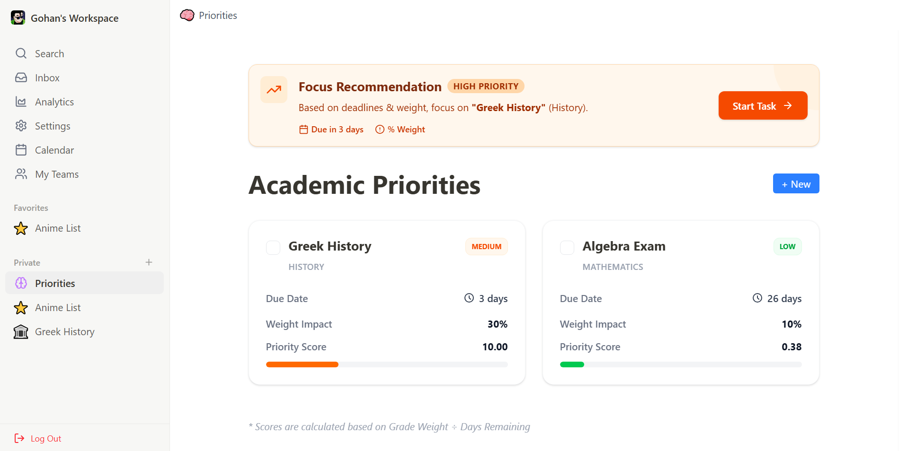
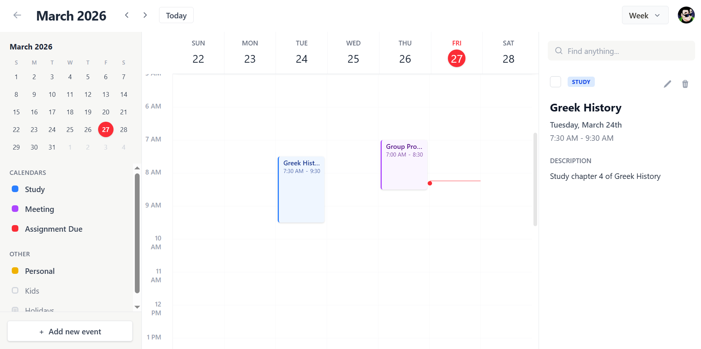

# UniVerse 🪐


> **Note:** This project is currently **under active development**. Features and UI are subject to change as we iterate on the design and functionality.





## 📖 About The Project

UniVerse is a full-stack, intelligent digital workspace engineered to eliminate academic workload anxiety. Moving beyond standard to-do lists, UniVerse utilizes a proprietary **Weighted Shortest Job First (WSJF)** algorithm to automatically calculate task urgency and impact, generating a dynamic 'Focus Score' that tells students exactly what to study next. 

Paired with a powerful, Notion-style collaborative rich-text editor, UniVerse provides a centralized hub for both task management and deep academic focus.

The goal is to solve the "tool overload" problem students face by providing a unified operating system for education.

## 🌐 Deployment

[](https://universe-nvhg.onrender.com)

UniVerse is deployed and running! Click the badge above to visit the live production environment. 

**Frontend Hosting:** [Render]
**Backend API:** [Render]
**Database:** MongoDB Atlas

## ✨ Key Features

* 🧠 **Algorithmic Prioritization:** Automated task sorting using a custom WSJF engine to calculate real-time Focus Scores.
* 📝 **Premium Rich-Text Workspace:** A headless editor built on TipTap and ProseMirror, featuring slash commands, custom image resizing, and context-aware bubble menus.
* 🤝 **Granular Collaboration:** Securely share notes with peers using role-based access control (Viewer vs. Editor permissions).
* 🌙 **Dynamic Theme Engine:** A fully responsive, sleek UI powered by Tailwind CSS v4 with a seamless system-aware Dark Mode.
* ☁️ **Optimized Cloud Media:** Integrated Cloudinary API for high-speed, secure image hosting directly within user notes.
* ⚡ **Desktop-Class Performance:** Features optimistic UI updates and debounced auto-saving for a zero-latency user experience.

## 🛠️ Tech Stack

**Client:** React.js, Vite, Tailwind CSS v4, TipTap, Lucide React, Date-fns, Axios  
**Server:** Node.js, Express.js  
**Database:** MongoDB, Mongoose (ODM)  
**Authentication:** JSON Web Tokens (JWT) & Bcrypt  
**Cloud Storage:** Cloudinary

## 🚀 Getting Started

To run this project locally, follow these steps:

1.  **Clone the repository**
    ```bash
    git clone https://github.com/SanithuM/universe.git
    cd universe
    ```

2.  **Install dependencies**
    ```bash
    npm install
    ```

3.  **Run the development server**
    ```bash
    npm run dev
    ```

4.  **Open in Browser**
    Visit `http://localhost:5173` to view the app.


## 📄 License

**Copyright (c) 2026 Eduppili Arachchige Sanithu Malhiru. All Rights Reserved.**

This software and associated documentation files (the "Software") are proprietary and confidential. Unauthorized copying, distribution, modification, or use of this Software, via any medium, is strictly prohibited without explicit written permission from the author.

---

